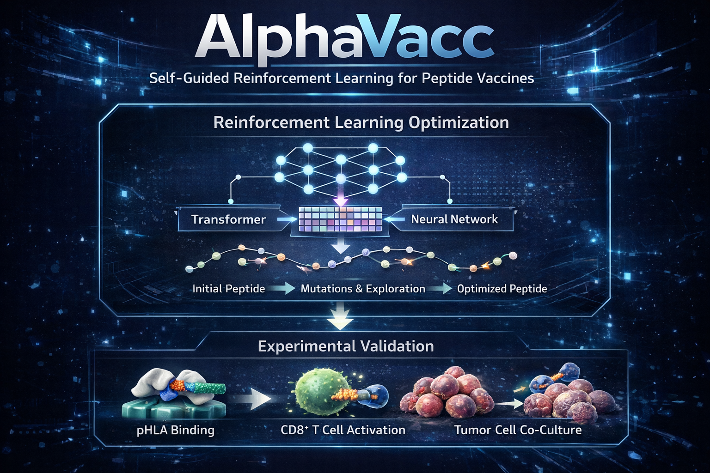

# AlphaVacc


AlphaVacc redefines HLA-presented peptide vaccine candidate design as an iterative sequence-search problem. It integrates self-guided reinforcement learning, interpretable mutation optimization, and experimental validation to optimize and generate peptide sequences from patient-specific or randomized starting peptides under selected HLA alleles. By intelligently exploring sequence space, AlphaVacc enables the construction of expanded libraries of high-potential peptide vaccine candidates for cancer immunotherapy research.

[](https://doi.org/10.5281/zenodo.17004419)

🌐 **Project Website:** [Visit the AlphaVacc web server](http://iqb.zju.edu.cn/servers/alphavacc)



---

## Table of Contents

- [AlphaVacc](#alphavacc)
  - [Table of Contents](#table-of-contents)
  - [Features](#features)
  - [Prerequisites](#prerequisites)
  - [Installation](#installation)
  - [Directory Structure](#directory-structure)
  - [Configuration](#configuration)
  - [Usage](#usage)
    - [Training (Supervised Fine‑Tuning)](#training-supervised-finetuning)
    - [Generation (Peptide Generation)](#generation-peptide-generation)
  - [Argument Reference](#argument-reference)
  - [Logging \& Outputs](#logging--outputs)
  - [License](#license)

---

## Features

* **Peptide hallucination process** for guided exploration of high‑immunogenicity sequences (MCTS + Transformer).
* **Neural network coach** that iteratively learns from self‑play.
* **Patient‑specific or random starting peptides**, with support for HLA allele targets via IEDB data.
* **Easy-to-use CLI**: separate scripts for training (`main.py`) and sequence generation (`predict.py`).

---

## Prerequisites

* Python 3.9+
* anaconda
* `coloredlogs`
* Other dependencies: see `environment.yml` 

Tested on Ubuntu 20.04 (x86_64) with Python 3.10.

---

## Installation

1. **Clone the repo**

   ```bash
   git clone https://github.com/ZGQVictory/AlphaVacc.git
   cd AlphaVacc
   ```

2. **Install dependencies**

   ```bash
   conda env create -f environment.yml
   conda activate AI
   ```

3. **Prepare data**

   * Place your IEDB target file (`IEDB-target-9res.txt`) under `data/IEDB/`.

---

## Directory Structure

```
AlphaVacc/
├── Coach.py
├── NNetwrapper.py
├── Search.py
├── peptideMutGame.py
├── peptideMutLogic.py
├── peptideMutNNet.py
├── ...
├── utils.py
├── main.py
├── predict.py
├── data/
│   └── AlphaVacc-generated mutation pairs/
│   └── Denovo-design tasks/
│   └── Optimization tasks/
│       └── AlphaVacc optimized peptides/
│       └── Baseline optimized peptides/
│   └── IEDB/
│       └── IEDB-target-9res.txt
│   └── endpoint/
│       ├── A0201_checkpoint/
│       ├── B4002_checkpoints/
│       ├── A0201_training_preparation/
│       └── B4002_training_preparation/
├── temp/                   # checkpoint directory
├── Predict_data/           # output directory for predictions
└── environment.yml 
```

`data/endpoint/` provides selected data and model weights for HLA-A*02:01 and HLA-B*40:02 described in the paper:

* `A0201_checkpoint/` and `B4002_checkpoints/` contain the corresponding model weights, training data, soft success peptides, and training hit IEDB peptides.
* `A0201_training_preparation/` and `B4002_training_preparation/` contain the corresponding IEDB datasets and pretrained weights.

---

## Configuration

Both `main.py` and `predict.py` define a `dotdict` named `args` containing hyperparameters and paths. Some names appear in both scripts but are used only by the training or prediction workflow. Major fields include:

* `pep_length` (int): peptide length (default 9)
* `res_type` (int): number of residue types (20)
* **Training and MCTS settings:**

  * `numIters` (`main.py`): total training iterations
  * `numEps` (`main.py`): self‑play games per training iteration
  * `numMCTSSims`: MCTS simulations per move
  * `MaxIterinONEepisode` (`main.py`): iterations for peptide optimization per self-play episode (default 100)
  * `cpuct`: PUCT exploration constant
* **Checkpoint & model loading:**

  * `checkpoint` (path)
  * `load_model` (bool)
  * `load_folder_file`: tuple (folder, filename)
* **IEDB data:**

  * `IEDBdir`, `IEDBtargetdatabase`
* **Mutation, scoring & prediction:**

  * `optimizationSTEP` (`predict.py`): iterations for peptide optimization when `Use_MCTS=False` (default 1000)
  * `MaxIterinONEepisode` (`predict.py`): iterations for peptide optimization when `Use_MCTS=True` (default 1000)
  * `Use_MCTS` (`predict.py`): enable MCTS for peptide optimization (default `True`)

See the [Argument Reference](#argument-reference) below for the full list.

---

## Usage

The current setup and default examples target HLA-A*02:01.

### Training (Supervised Fine‑Tuning)

To train HLA-B*40:02, replace the contents of `data/IEDB/IEDB-target-9res.txt` with `data/endpoint/B4002_training_preparation/B4002_IEDB-target-9res.txt`, and replace `./pretrain_state_dict.0.pkl` with `data/endpoint/B4002_training_preparation/B4002_pretrain_state_dict.0.pkl` (keeping the destination filenames).

For other HLA alleles, download the corresponding IEDB data from [IEDB](https://www.iedb.org/) and obtain pretrained weights by following the pre-train section of [FEPaML](https://github.com/zhongqinglu/FEPaML).

Using 'main.py' script.

```bash
python main.py
```

This will:

1. Initialize logging (`coloredlogs` at DEBUG).
2. Rotate old record files, create new `Startrecord-YYYYMMDDHHMM.txt` and `Manualrecord-YYYYMMDDHHMM.txt`.
3. Load IEDB targets.
4. Instantiate the game (`peptideMutGame`) and neural net (`NNetWrapper`).
5. Optionally load a checkpoint (`load_model`).
6. Start the learning loop via `Coach.learn()`.

You can modify hyperparameters directly in `main.py`’s `args`, or extend it to accept CLI flags.

---

### Generation (Peptide Generation)

Using 'predict.py' script. Replace "\<peptide\>" in the script to be the starting peptide sequence.

```bash
python predict.py <checkpoint_filename>
```

Place the corresponding model checkpoint from `data/endpoint/` in `./temp/` before prediction.

HLA-A*02:01 example:

```bash
i="CQWGRLWQL"
cp predict.py predict-$i.py
sed -i "s/<peptide>/$i/g" predict-$i.py
python predict-$i.py A0201_checkpoint_70.pth.tar
```

For HLA-B*40:02, use the matching IEDB data and pretrained weights as described above, then run:

```bash
i="GERQNATEI"
cp predict.py predict-$i.py
sed -i "s/<peptide>/$i/g" predict-$i.py
python predict-$i.py B4002_checkpoint_87.pth.tar
```

This script:

1. Rotates old update files in `Predict_data/` and creates a new `update-<checkpoint>-<startpeptide>-YYYYMMDDHHMM.txt`.
2. Loads the trained model checkpoint.
3. Runs an MCTS episode limited by `MaxIterinONEepisode` when `Use_MCTS=True`; otherwise runs `Search.predict_usingNN(...)` for `optimizationSTEP` iterations.
4. Appends each generated peptide sequence to the update file, marking win/loss.

---

## Argument Reference

The table below covers every field defined in the `args` dictionaries of `main.py` and `predict.py`. “Not defined” means that the field is absent from that script; “unused” means that the script defines it but its active workflow does not read it.

| Argument                          | `main.py` default                      | `predict.py` default          | Description                                                                                                                                     |
| --------------------------------- | -------------------------------------- | ----------------------------- | ----------------------------------------------------------------------------------------------------------------------------------------------- |
| **Sequence representation**       |                                        |                               |                                                                                                                                                 |
| `pep_length`                      | `9`                                    | `9`                           | Length of each peptide sequence.                                                                                                                |
| `res_type`                        | `20`                                   | `20`                          | Number of amino-acid residue types available at each position.                                                                                  |
| **Training and MCTS**             |                                        |                               |                                                                                                                                                 |
| `numIters`                        | `100`                                  | `100` (unused)                | Number of training iterations.                                                                                                                  |
| `numEps`                          | `200`                                  | `200` (unused)                | Number of self-play episodes generated per training iteration.                                                                                  |
| `numMCTSSims`                     | `200`                                  | `200`                         | Number of MCTS simulations used to calculate the action probabilities for each move.                                                            |
| `arenaCompare`                    | `10`                                   | `10` (unused)                 | Number of arena games used to compare the newly trained model with the previous model.                                                          |
| `cpuct`                           | `0.3`                                  | `0.3`                         | PUCT exploration constant applied to the policy-prior exploration term.                                                                         |
| `numItersForTrainExamplesHistory` | `20`                                   | `20` (unused)                 | Maximum number of recent training iterations whose self-play examples are retained.                                                             |
| `MaxIterinONEepisode`             | `100`                                  | `1000`                        | Maximum peptide-optimization steps per self-play episode; in prediction it controls the MCTS path used when `Use_MCTS=True`.                    |
| `playtoend`                       | `0.1`                                  | `0.1` (unused)                | Fraction of training self-play episodes that ignore neural-network early stopping and continue until an IEDB hit or the episode limit.          |
| **Checkpoint and output paths**   |                                        |                               |                                                                                                                                                 |
| `checkpoint`                      | `'./temp/'`                            | `'./temp'` (unused)           | Directory in which training checkpoints and serialized training examples are saved.                                                             |
| `load_model`                      | `False`                                | `True`                        | Whether to load the model specified by `load_folder_file`; in `main.py`, also load its `.examples` training history.                            |
| `load_folder_file`                | `('./temp/', 'checkpoint_11.pth.tar')` | `('./temp', checkpointmodel)` | `(directory, filename)` tuple for the checkpoint to load; `checkpointmodel` is the first command-line argument to `predict.py`.                 |
| `predict_directory`               | Not defined                            | `'./Predict_data/<peptide>'`  | Directory in which prediction output is created; `<peptide>` is replaced in the copied prediction script.                                       |
| **Peptide initialization**        |                                        |                               |                                                                                                                                                 |
| `startpeptide`                    | `None`                                 | `'<peptide>'`                 | Starting peptide; `None` generates a random peptide, while prediction replaces the placeholder with the requested sequence.                     |
| **IEDB data**                     |                                        |                               |                                                                                                                                                 |
| `IEDBdir`                         | `'./data/IEDB'`                        | `'./data/IEDB'`               | Directory containing the IEDB target-peptide file.                                                                                              |
| `IEDBtargetdatabase`              | `'IEDB-target-9res.txt'`               | `'IEDB-target-9res.txt'`      | IEDB target filename; its first line is skipped and only nine-residue sequences are loaded.                                                     |
| **Prediction mode**               |                                        |                               |                                                                                                                                                 |
| `optimizationSTEP`                | Not defined                            | `1000`                        | Number of peptide-optimization iterations when `Use_MCTS=False`.                                                                                |
| `Use_MCTS`                        | Not defined                            | `True`                        | Selects MCTS prediction via `Search.executeEpisode()` when true, or direct neural-network prediction via `Search.predict_usingNN()` when false. |

---

## Logging & Outputs

* **Training logs** are printed to console via `coloredlogs`.
* **Record files** stored in working directory:

  * `Startrecord-YYYYMMDDHHMM.txt`
  * `Manualrecord-YYYYMMDDHHMM.txt`
* **Prediction outputs** appended under `Predict_data/` as `update-<checkpoint>-<startpeptide>-<timestamp>.txt`.

---

## License

This project is licensed under the [MIT License](LICENSE).
